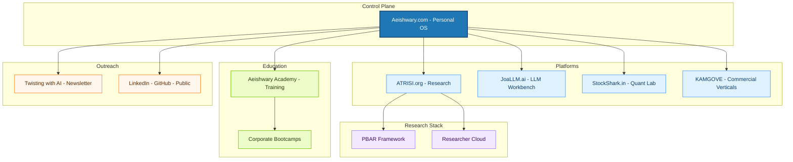
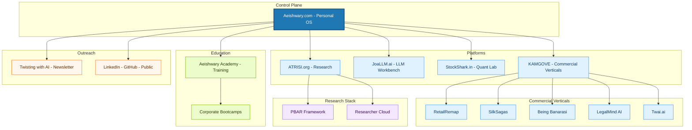
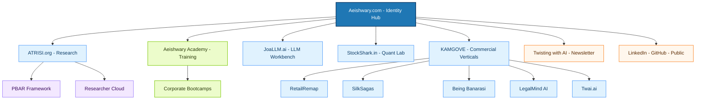
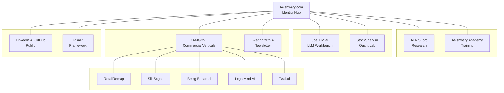
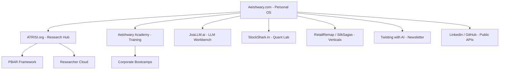

1

```mermaid
graph TD

%% ================== LAYOUT ==================
%% Top: Control Plane -> Middle: Platforms/Education -> Bottom: Outreach/Research Stack

%% ---------- Control Plane ----------
subgraph CP[Control Plane]
  A[Aeishwary.com - Personal OS]
end

%% ---------- Platforms ----------
subgraph PL[Platforms]
  B[ATRISI.org - Research]
  D[JoaLLM.ai - LLM Workbench]
  E[StockShark.in - Quant Lab]
  F[KAMGOVE - Commercial Verticals]
end

%% ---------- Education ----------
subgraph ED[Education]
  C[Aeishwary Academy - Training]
  K[Corporate Bootcamps]
end

%% ---------- Outreach ----------
subgraph OC[Outreach]
  G[Twisting with AI - Newsletter]
  H[LinkedIn - GitHub - Public]
end

%% ---------- Research Stack ----------
subgraph RS[Research Stack]
  I[PBAR Framework]
  J[Researcher Cloud]
end

%% ================== EDGES ==================
A --> B
A --> C
A --> D
A --> E
A --> F
A --> G
A --> H

B --> I
B --> J
C --> K

%% ================== STYLES ==================
classDef core fill:#1f77b4,color:#ffffff,stroke:#0d3a66,stroke-width:2px;
classDef product fill:#e0f2fe,color:#0b3b66,stroke:#60a5fa,stroke-width:1.5px;
classDef edu fill:#ecfccb,color:#2a3b0a,stroke:#84cc16,stroke-width:1.5px;
classDef outreach fill:#fff7ed,color:#5b2a00,stroke:#fb923c,stroke-width:1.5px;
classDef research fill:#f3e8ff,color:#3b0a5e,stroke:#a78bfa,stroke-width:1.5px;

class A core;
class B,D,E,F product;
class C,K edu;
class G,H outreach;
class I,J research;

```

2

```mermaid
graph TD

%% ================== LAYOUT ==================
%% Top: Control Plane -> Middle: Platforms/Education -> Bottom: Outreach/Research Stack

%% ---------- Control Plane ----------
subgraph CP[Control Plane]
  A[Aeishwary.com - Personal OS]
end

%% ---------- Platforms ----------
subgraph PL[Platforms]
  B[ATRISI.org - Research]
  D[JoaLLM.ai - LLM Workbench]
  E[StockShark.in - Quant Lab]
  F[KAMGOVE - Commercial Verticals]
end

%% ---------- KAMGOVE Ventures ----------
subgraph KV[Commercial Verticals]
  V1[RetailRemap]
  V2[SilkSagas]
  V3[Being Banarasi]
  V4[LegalMind AI]
  V5[Twai.ai]
end

%% ---------- Education ----------
subgraph ED[Education]
  C[Aeishwary Academy - Training]
  K[Corporate Bootcamps]
end

%% ---------- Outreach ----------
subgraph OC[Outreach]
  G[Twisting with AI - Newsletter]
  H[LinkedIn - GitHub - Public]
end

%% ---------- Research Stack ----------
subgraph RS[Research Stack]
  I[PBAR Framework]
  J[Researcher Cloud]
end

%% ================== EDGES ==================
A --> B
A --> C
A --> D
A --> E
A --> F
A --> G
A --> H

B --> I
B --> J
C --> K

%% KAMGOVE fan-out
F --> V1
F --> V2
F --> V3
F --> V4
F --> V5

%% ================== STYLES ==================
classDef core fill:#1f77b4,color:#ffffff,stroke:#0d3a66,stroke-width:2px;
classDef product fill:#e0f2fe,color:#0b3b66,stroke:#60a5fa,stroke-width:1.5px;
classDef edu fill:#ecfccb,color:#2a3b0a,stroke:#84cc16,stroke-width:1.5px;
classDef outreach fill:#fff7ed,color:#5b2a00,stroke:#fb923c,stroke-width:1.5px;
classDef research fill:#f3e8ff,color:#3b0a5e,stroke:#a78bfa,stroke-width:1.5px;

class A core;
class B,D,E,F product;
class V1,V2,V3,V4,V5 product;
class C,K edu;
class G,H outreach;
class I,J research;
```

3

```mermaid
graph TD

%% Center Hub
A[Aeishwary.com - Identity Hub]

%% Spokes
B[ATRISI.org - Research]
C[Aeishwary Academy - Training]
D[JoaLLM.ai - LLM Workbench]
E[StockShark.in - Quant Lab]
F[KAMGOVE - Commercial Verticals]
G[Twisting with AI - Newsletter]
H[LinkedIn - GitHub - Public]
I[PBAR Framework]
J[Researcher Cloud]
K[Corporate Bootcamps]
V1[RetailRemap]
V2[SilkSagas]
V3[Being Banarasi]
V4[LegalMind AI]
V5[Twai.ai]

%% Hub edges
A --> B
A --> C
A --> D
A --> E
A --> F
A --> G
A --> H

%% Secondary spokes
B --> I
B --> J
C --> K
F --> V1
F --> V2
F --> V3
F --> V4
F --> V5

%% Styles
classDef core fill:#1f77b4,color:#ffffff,stroke:#0d3a66,stroke-width:2px;
classDef product fill:#e0f2fe,color:#0b3b66,stroke:#60a5fa,stroke-width:1.5px;
classDef edu fill:#ecfccb,color:#2a3b0a,stroke:#84cc16,stroke-width:1.5px;
classDef outreach fill:#fff7ed,color:#5b2a00,stroke:#fb923c,stroke-width:1.5px;
classDef research fill:#f3e8ff,color:#3b0a5e,stroke:#a78bfa,stroke-width:1.5px;

class A core;
class B,D,E,F,V1,V2,V3,V4,V5 product;
class C,K edu;
class G,H outreach;
class I,J research;
```

4

```mermaid
graph TB
  %% Center hub
  A[Aeishwary.com<br/>Identity Hub]

  %% Rings of spokes
  subgraph Top[" "]
    B[ATRISI.org<br/>Research]
    C[Aeishwary Academy<br/>Training]
  end
  subgraph Right[" "]
    D[JoaLLM.ai<br/>LLM Workbench]
    E[StockShark.in<br/>Quant Lab]
  end
  subgraph Bottom[" "]
    F[KAMGOVE<br/>Commercial Verticals]
    G[Twisting with AI<br/>Newsletter]
  end
  subgraph Left[" "]
    H[LinkedIn · GitHub<br/>Public]
    I[PBAR<br/>Framework]
  end

  %% KAMGOVE Ventures
  subgraph KV[" "]
    V1[RetailRemap]
    V2[SilkSagas]
    V3[Being Banarasi]
    V4[LegalMind AI]
    V5[Twai.ai]
  end

  %% Spokes
  A --- B
  A --- C
  A --- D
  A --- E
  A --- F
  A --- G
  A --- H
  A --- I

  %% KAMGOVE fan-out
  F --- V1
  F --- V2
  F --- V3
  F --- V4
  F --- V5
```

5

```mermaid
graph TD
  A[Aeishwary.com - Personal OS]
  B[ATRISI.org - Research Hub]
  C[Aeishwary Academy - Training]
  D[JoaLLM.ai - LLM Workbench]
  E[StockShark.in - Quant Lab]
  F[RetailRemap / SilkSagas - Verticals]
  G[Twisting with AI - Newsletter]
  H[LinkedIn / GitHub - Public APIs]
  I[PBAR Framework]
  J[Researcher Cloud]
  K[Corporate Bootcamps]

  A --> B
  A --> C
  A --> D
  A --> E
  A --> F
  A --> G
  A --> H

  B --> I
  B --> J
  C --> K


```
